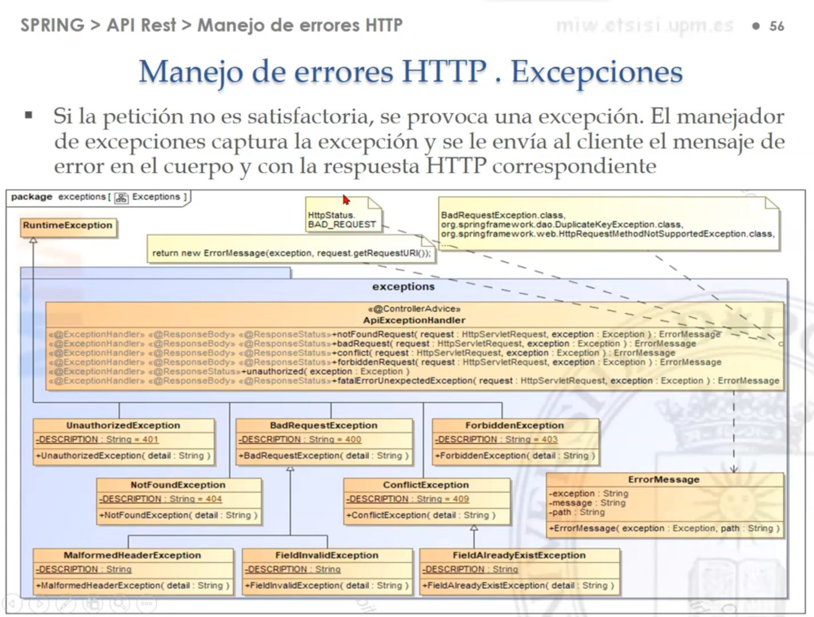
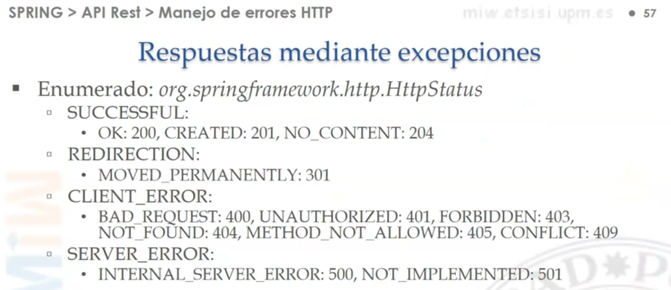

# [Spring Boot. API Rest. Tratamiento de errores. Excepciones](https://www.youtube.com/watch?v=S-OzBDHpACg)

Para este proyecto se tomó como referencia el tutorial del canal de youtube **miw-upm**

---

## Dependencias

````xml
<!--Spring Boot 3.2.3-->
<!--Java 21-->
<dependencies>
    <dependency>
        <groupId>org.springframework.boot</groupId>
        <artifactId>spring-boot-starter-data-jpa</artifactId>
    </dependency>
    <dependency>
        <groupId>org.springframework.boot</groupId>
        <artifactId>spring-boot-starter-web</artifactId>
    </dependency>
    <dependency>
        <groupId>org.springframework.boot</groupId>
        <artifactId>spring-boot-starter-validation</artifactId>
    </dependency>

    <dependency>
        <groupId>com.mysql</groupId>
        <artifactId>mysql-connector-j</artifactId>
        <scope>runtime</scope>
    </dependency>
    <dependency>
        <groupId>org.projectlombok</groupId>
        <artifactId>lombok</artifactId>
        <optional>true</optional>
    </dependency>
    <dependency>
        <groupId>org.springframework.boot</groupId>
        <artifactId>spring-boot-starter-test</artifactId>
        <scope>test</scope>
    </dependency>
</dependencies>
````

## Entidad

````java

@AllArgsConstructor
@NoArgsConstructor
@Builder
@Data
@Entity
@Table(name = "customers")
public class Customer {
    @Id
    @GeneratedValue(strategy = GenerationType.IDENTITY)
    private Long id;

    @Column(nullable = false)
    private String name;

    @Column(nullable = false, unique = true)
    private String email;

    @Column(unique = true)
    private String phoneNumber;
}
````

## Repositorio

````java
public interface CustomerRepository extends JpaRepository<Customer, Long> {
    Optional<Customer> findCustomerByEmail(String email);
}
````

## Servicio

````java
public interface CustomerService {
    List<Customer> findAllCustomers();

    Customer findCustomerById(Long id);

    Customer findCustomerByEmail(String email);

    Customer saveCustomer(Customer customer);

    Customer updateCustomer(Long id, Customer customer);

    void deleteCustomerById(Long id);
}
````

Notar que por el momento, si es que falla al encontrar al `customer` lanzaremos una excepción pero por ahora
será `null`, más adelante implementaremos el controlador de excepciones:

````java

@RequiredArgsConstructor
@Slf4j
@Service
public class CustomerServiceImpl implements CustomerService {

    private final CustomerRepository customerRepository;

    @Override
    @Transactional(readOnly = true)
    public List<Customer> findAllCustomers() {
        return this.customerRepository.findAll();
    }

    @Override
    @Transactional(readOnly = true)
    public Customer findCustomerById(Long id) {
        return this.customerRepository.findById(id)
                .orElseThrow(() -> null);
    }

    @Override
    @Transactional(readOnly = true)
    public Customer findCustomerByEmail(String email) {
        return this.customerRepository.findCustomerByEmail(email)
                .orElseThrow(() -> null);
    }

    @Override
    @Transactional
    public Customer saveCustomer(Customer customer) {
        return this.customerRepository.save(customer);
    }

    @Override
    @Transactional
    public Customer updateCustomer(Long id, Customer customer) {
        return this.customerRepository.findById(id)
                .map(customerDB -> {
                    customerDB.setName(customer.getName());
                    customerDB.setEmail(customer.getEmail());
                    if (!customer.getPhoneNumber().isBlank()) {
                        customerDB.setPhoneNumber(customer.getPhoneNumber());
                    }
                    return customerDB;
                })
                .map(this.customerRepository::save)
                .orElseThrow(() -> null);
    }

    @Override
    @Transactional
    public void deleteCustomerById(Long id) {
        this.customerRepository.findById(id)
                .map(customerDB -> {
                    this.customerRepository.deleteById(id);
                    return true;
                })
                .orElseThrow(() -> null);
    }
}
````

## Rest Controller

````java

@RequiredArgsConstructor
@Slf4j
@RestController
@RequestMapping(path = "/api/v1/customers")
public class CustomerRestController {

    private final CustomerService customerService;

    @GetMapping
    public ResponseEntity<List<Customer>> listAllCustomers() {
        return ResponseEntity.ok(this.customerService.findAllCustomers());
    }

    @GetMapping(path = "/{id}")
    public ResponseEntity<Customer> getCustomerById(@PathVariable Long id) {
        return ResponseEntity.ok(this.customerService.findCustomerById(id));
    }

    @GetMapping(path = "/email/{email}")
    public ResponseEntity<Customer> getCustomerByEmail(@PathVariable String email) {
        return ResponseEntity.ok(this.customerService.findCustomerByEmail(email));
    }

    @PostMapping
    public ResponseEntity<Customer> saveCustomer(@RequestBody Customer customer) {
        Customer customerDB = this.customerService.saveCustomer(customer);
        URI location = URI.create("/api/v1/customers/" + customerDB.getId());
        return ResponseEntity.created(location).body(customerDB);
    }

    @PutMapping(path = "/{id}")
    public ResponseEntity<Customer> updateCustomer(@PathVariable Long id, @RequestBody Customer customer) {
        return ResponseEntity.ok(this.customerService.updateCustomer(id, customer));
    }

    @DeleteMapping(path = "/{id}")
    public ResponseEntity<Void> deleteCustomer(@PathVariable Long id) {
        this.customerService.deleteCustomerById(id);
        return ResponseEntity.noContent().build();
    }
}
````

## Configuraciones de la aplicación

````yml
server:
  port: 8080
  error:
    include-message: always

spring:
  application:
    name: spring-boot-exception-handling

  datasource:
    url: jdbc:mysql://localhost:3306/db_spring_data_jpa
    username: admin
    password: magadiflo

  jpa:
    hibernate:
      ddl-auto: create-drop
    properties:
      hibernate:
        format_sql: true

logging:
  level:
    org.hibernate.SQL: DEBUG
    org.hibernate.orm.jdbc.bind: TRACE
````

## import.sql

En el `src/main/resources` crearemos el archivo `import.sql` donde definiremos algunos registros que se insertarán en
la tabla `customers`. Recordar que la tabla se creará de manera automática en la base de datos gracias a la
configuración `spring.jpa.hibernate.ddl-auto=create-drop`.

````sql
INSERT INTO customers (name, email, phone_number) VALUES('Juan Pérez', 'juan@example.com', '555-1234');
INSERT INTO customers (name, email, phone_number) VALUES('María García', 'maria@example.com', '555-5678');
INSERT INTO customers (name, email, phone_number) VALUES('Pedro López', 'pedro@example.com', '555-9012');
INSERT INTO customers (name, email, phone_number) VALUES('Ana Martínez', 'ana@example.com', '555-3456');
INSERT INTO customers (name, email, phone_number) VALUES('Luis Hernández', 'luis@example.com', '555-7890');
INSERT INTO customers (name, email, phone_number) VALUES('Sofía Rodríguez', 'sofia@example.com', '555-2345');
INSERT INTO customers (name, email, phone_number) VALUES('Carlos Sánchez', 'carlos@example.com', '555-6789');
INSERT INTO customers (name, email, phone_number) VALUES('Laura Gómez', 'laura@example.com', '555-0123');
INSERT INTO customers (name, email, phone_number) VALUES('Daniel Fernández', 'daniel@example.com', '555-4567');
INSERT INTO customers (name, email, phone_number) VALUES('Marta Díaz', 'marta@example.com', '555-8901');
````

---

# Tratamiento de Excepciones

---

Tomaremos como referencia el siguiente diagrama mostrado en el tutorial:



Es importante recordar las respuestas que podríamos lanzar:



## Agregando anotaciones de validación a la entidad

Es importante, recordar que en un proyecto real debemos usar DTOs y colocar las anotaciones de validación en dichos
DTOs, mientras que las entidades únicamente están destinadas a trabajar con la base de datos, pero para hacerlo más
sencillo, es que en este proyecto se está trabajando directamente con la entidad.

````java

@AllArgsConstructor
@NoArgsConstructor
@Builder
@Data
@Entity
@Table(name = "customers")
public class Customer {
    @Id
    @GeneratedValue(strategy = GenerationType.IDENTITY)
    private Long id;

    @NotBlank
    @Size(min = 3, max = 20)
    @Pattern(regexp = "[a-zA-Z]+", message = "El name solo puede contener letras")
    @Column(nullable = false)
    private String name;

    @NotBlank
    @Email
    @Column(nullable = false, unique = true)
    private String email;

    @Pattern(regexp = "[0-9]+", message = "El phone number solo puede contener números")
    @Column(unique = true)
    private String phoneNumber;
}
````

## Creando excepciones principales

Definimos nuestras excepciones personalizadas que extienden de `RuntimeException`:

````java
public class BadRequestException extends RuntimeException {
    public BadRequestException(String message) {
        super(message);
    }
}
````

````java
public class ConflictException extends RuntimeException {
    public ConflictException(String message) {
        super(message);
    }
}
````

````java
public class ForbiddenException extends RuntimeException {
    public ForbiddenException(String message) {
        super(message);
    }
}
````

````java
public class NotFoundException extends RuntimeException {
    public NotFoundException(String message) {
        super(message);
    }
}
````

````java
public class UnauthorizedException extends RuntimeException {
    public UnauthorizedException(String message) {
        super(message);
    }
}
````

## Creando excepciones más específicas

Estas excepciones son más específicas, así que heredamos de alguna excepción principal:

````java
public class FieldAlreadyExistException extends ConflictException {
    public FieldAlreadyExistException(String message) {
        super(message);
    }
}
````

````java
public class FieldInvalidException extends BadRequestException {
    public FieldInvalidException(String message) {
        super(message);
    }
}
````

````java
public class MalformedHeaderException extends BadRequestException {
    public MalformedHeaderException(String message) {
        super(message);
    }
}
````

## Creando clase que unificará respuesta de excepción

Creamos una clase que seá la que definirá el formato que tendrán todas nuestras respuestas de excepciones cuando un
cliente realice alguna petición y nuestro backend falle. En el código siguiente se muestra entre comentarios un
posible ejemplo de los valores que tendrán los campos:

````java

@ToString
@Getter
public class ApiExceptionMessage {

    private final String simpleName;    // FieldInvalidException
    private final String httpStatus;    // BAD_REQUEST
    private final Integer code;         // 400
    private final String message;       // El email 'martin.com' es incorrecto

    @JsonInclude(JsonInclude.Include.NON_NULL)
    private final List<FieldExceptionMessage> fieldErrors;

    public ApiExceptionMessage(String simpleName, HttpStatus httpStatus, String message, List<FieldExceptionMessage> fieldErrors) {
        this.simpleName = simpleName;
        this.httpStatus = httpStatus.name();
        this.code = httpStatus.value();
        this.message = message;
        this.fieldErrors = fieldErrors;
    }

}
````

En el código anterior vemos un campo llamado `fieldErrors`, quien contendrá los errores correspondientes a los
campos cuyas validaciones hayan fallado. La anotación `@JsonInclude(JsonInclude.Include.NON_NULL)` significa que si
el campo `fieldErrors` es `NULL` entonces, no se va a serializar en la respuesta `JSON`; en otras palabras, para que
el campo `fieldErrors` se incluya en la respuesta json al cliente, este campo debe ser `NON_NULL`.

El campo `fieldErrors` es una lista de `FieldExceptionMessage` quien contendrá el nombre del campo y su lista de
errores:

````java

@ToString
@Getter
public class FieldExceptionMessage {

    private final String field;
    private final List<String> errors = new ArrayList<>();

    public FieldExceptionMessage(String field) {
        this.field = field;
    }

}
````

## Rest Controller Advice

Creamos nuestro controlador principal donde centralizaremos el manejo de excepciones aplicaremos cierta lógica y
retornaremos el mensaje unificado al cliente:

````java

@Slf4j
@RestControllerAdvice
public class ApiExceptionHandler {
    @ExceptionHandler(NotFoundException.class)
    public ResponseEntity<ApiExceptionMessage> notFoundException(Exception exception) {
        return this.responseEntity(exception.getClass().getSimpleName(), HttpStatus.NOT_FOUND, exception.getMessage());
    }

    @ExceptionHandler({
            BadRequestException.class,
            MethodArgumentNotValidException.class,
            HttpRequestMethodNotSupportedException.class,
            MissingRequestHeaderException.class,
            MissingServletRequestParameterException.class,
            MethodArgumentTypeMismatchException.class,
            HttpMessageNotReadableException.class
    })
    public ResponseEntity<ApiExceptionMessage> badRequestException(Exception exception) {

        if (exception instanceof MethodArgumentNotValidException) {
            List<FieldExceptionMessage> errors = new ArrayList<>();
            Map<String, FieldExceptionMessage> validatedFieldMap = new HashMap<>();
            BindingResult bindingResult = ((MethodArgumentNotValidException) exception).getBindingResult();

            bindingResult.getAllErrors().forEach(objectError -> {
                String fieldName = ((FieldError) objectError).getField();
                String errorMessage = objectError.getDefaultMessage();

                FieldExceptionMessage fieldExceptionMessage = validatedFieldMap.computeIfAbsent(fieldName, FieldExceptionMessage::new);
                fieldExceptionMessage.getErrors().add(errorMessage);

                if (!errors.contains(fieldExceptionMessage)) {
                    errors.add(fieldExceptionMessage);
                }
            });

            return this.responseEntity(exception.getClass().getSimpleName(), HttpStatus.BAD_REQUEST, "Se detectaron errores en los campos", errors);
        }

        return this.responseEntity(exception.getClass().getSimpleName(), HttpStatus.BAD_REQUEST, exception.getMessage());
    }

    @ExceptionHandler({
            ConflictException.class,
            DataIntegrityViolationException.class,
            DuplicateKeyException.class
    })
    public ResponseEntity<ApiExceptionMessage> conflictException(Exception exception) {
        String message = switch (exception) {
            case DuplicateKeyException duplicate -> duplicate.getMostSpecificCause().toString();
            case DataIntegrityViolationException di -> di.getMostSpecificCause().toString().split(":")[1].trim();
            default -> exception.getMessage();
        };
        return this.responseEntity(exception.getClass().getSimpleName(), HttpStatus.CONFLICT, message);
    }

    @ExceptionHandler(ForbiddenException.class)
    public ResponseEntity<ApiExceptionMessage> forbiddenException(Exception exception) {
        return this.responseEntity(exception.getClass().getSimpleName(), HttpStatus.FORBIDDEN, exception.getMessage());
    }

    @ExceptionHandler(UnauthorizedException.class)
    public ResponseEntity<Void> unauthorizedException() {
        return ResponseEntity.status(HttpStatus.UNAUTHORIZED).build();
    }

    @ExceptionHandler(Exception.class)
    public ResponseEntity<ApiExceptionMessage> fatalErrorUnexpectedException(Exception exception) {
        return this.responseEntity(exception.getClass().getSimpleName(), HttpStatus.INTERNAL_SERVER_ERROR, exception.getMessage());
    }

    private ResponseEntity<ApiExceptionMessage> responseEntity(String simpleName, HttpStatus httpStatus, String message) {
        return this.responseEntity(simpleName, httpStatus, message, null);
    }

    private ResponseEntity<ApiExceptionMessage> responseEntity(String simpleName, HttpStatus httpStatus, String message, List<FieldExceptionMessage> fieldErrors) {
        return ResponseEntity.status(httpStatus).body(new ApiExceptionMessage(simpleName, httpStatus, message, fieldErrors));
    }
}
````

Es importante notar que podemos agrupar las excepciones de java en un mismo método handler. Ahora, recordemos que hemos
creado excepciones personalizadas principales y específicas, en ese sentido, cuando definamos un método
`@ExceptionHandler` basta con especificar la excepción principal, de esa manera, cuando lancemos una excepción
específica, la excepción principal podrá capturarlo.

